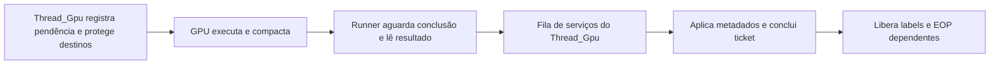

# Escritas da GPU por V# de runtime: nova arquitetura do lado da CPU

Data: 2026-10-08. Autor: sessão Claude Code (mesmo usuário). Base: `guest-sync-release-mem` em `192afd16`.
**Estado atualizado:** fase 0 runtime e F1/F2/F4 integradas; F3 implementada e validada
no worktree cpu-coherence-service. F5 concluída em opt-in e revisada: build Release
aprovado, 53/54 testes passaram; a falha FMASK também ocorre na base F3. As seções
iniciais registram o desenho histórico; os contratos corrigidos estão na seção 9 e as entregas nas seções 12–13. A proposta de RT por hardware está na seção 14.

**Regra do usuário:** as nossas otimizações ficam. Nada pode substituir ou reverter:

- a sincronização BDA (batch protect, incremental, dirty-log, hot pages, coalescing de upload);
- o CP sequencer e o recorder;
- os certificados do DrawPrep e os draw runs;
- a velocidade de compilação de shader;
- os loads de storage buffer sem branch (`f7613468`, `a6037785`);
- os strides em runtime (`ef93d6f6`) e o bindless por shader;
- a chave do program cache.

**Alvo de desempenho:** AMD Radeon. O host é a RX 9070 XT (RDNA4, RADV) com um Ryzen 5700X. O
Thread_Gpu é o thread crítico.

---

## 1. O problema

Um compute shader que faz store ou atomic por um V# calculado em runtime é pulado por inteiro,
com todos os seus dispatches e draws:

- **Detecção:** o `GetHandle` falha para V# de runtime (`ResourceTracking.cpp:1452-1456`).
- **Com `KYTY_SRT_VARIANT_READS=1`, ligado no preset U59:** o caso cai no `MarkUnresolved`
  (`:1657-1660`) e o programa é pulado (`ShaderRecompiler.cpp:908-918`).
- **Sem a chave:** o `EXIT`.
- **Sem caminho de escrita:** só os loads viram `IndirectBuffer` (`ShaderIR.h:80-88`). O
  `EmitStoreMemory` não tem o ramo `IndirectBuffer` (`spirvEmitterMemory.cpp:1689-1705`).

**Evidência no Ghost of Yōtei** (`_Build/linux-clang/install/_kyty.txt`, 2026-10-04, modo Performance):

| CS | pc | O que bloqueia | Contexto no jogo |
| --- | --- | --- | --- |
| `0x86da5eb7b8257bb0` | 0x530 | `BUFFER_STORE_DWORD` por V# de runtime | depois de "Water Lighting" / "Wait for Cull CS Lights" |
| `0xd8959888aafd2552` | 0x1b4 | `BUFFER_STORE_DWORD` por V# de runtime | depois de "Enqueue Shadow Resolve" |
| `0x34be6ffcc212383c`, `0xa3e51cce2e56913e`, `0xf3eb7bc6a9cd938d`, `0x8968b4b53e5a246a` | 0x5c8, 0x708, 0x85c, 0xed8 | `image_sample_d` com T#/S# de runtime (relatado, a confirmar) | — |
| `174082508acf6307`, `40395313615abcc8`, `6cc64dee32dc7094` | 0x1500, 0x760, 0x656c | `BUFFER_LOAD_USHORT` por V# de runtime | `docs/perf-research/shader-pr-ports-2026-10-07.md:90-93` |

No modo RT do Yōtei (3 a 5) há mais 9 kernels pulados pelo mesmo motivo e 1 kernel BVH64. Isso
está na seção 7.

## 1b. Segundo objetivo: o gargalo do Thread_Gpu

O usuário quer que a mesma arquitetura também resolva o gargalo atual. As medidas abaixo são do
Crash 4, em 2026-10-06/07, com `perf` a 499 Hz no binário Release.

- **Caminho crítico:** o Thread_Gpu, com cerca de 33 ms de CPU por frame (54 µs/draw).
- **Sincronização BDA** (`PrepareBda` → `SynchronizeBdaBuffersNow`): 41% do Thread_Gpu, cerca de
  13,6 ms/frame. Dentro dela:
  - o `memmove` das cópias de upload no `SynchronizeBuffer` toma 13%;
  - o `ApplyProtectBatch` (`mprotect`) toma 8%.
- **Faults em cena estável:** 176 por frame × 119 µs, cerca de 21 ms/frame, mais 2.787 chamadas
  de proteção por frame × 5,7 µs. Com `KYTY_UFFD_WP=1`, o fault cai para 35-40 µs e a proteção
  para 2,7 µs. É o trabalho atual do Codex.
- **Yōtei, cena aquecida:** 20 fps, 756 ms/s esperando a GPU, 1.187 esperas/s e 3.177 faults de
  rastreamento de escrita por segundo.

**Ideia rejeitada antes, e por quê:** mover a cópia guest→staging para um worker era o maior ganho
estimado (3-4 ms/frame). Foi descartada porque as escritas do próprio CP na memória do guest
(`WRITE_DATA`, `DUMP_CONST_RAM`, LOD stats) precisam esperar as cópias pendentes dos seus
destinos. Sem isso, pacotes posteriores vazariam para os uploads de draws anteriores.

### 1b.1 Achado: neste host, todo o memcpy guest→staging roda no Thread_Gpu

- **O caminho que já existe para tirar a cópia do Thread_Gpu** é o host copy do `UploadDma`
  (`KYTY_UPLOAD_DMA_HOST_COPY`, `uploadDma.h`). Ele só existe com o `UploadDma`, e o `UploadDma`
  exige uma família de fila **transfer-only**: a busca está em `vulkanWindow.cpp:670-689`, e o
  `UploadDma::Create` devolve nulo sem ela (`uploadDma.cpp:51`).
- **O RADV não expõe essa família por padrão.** Segundo a [doc do Mesa](https://docs.mesa3d.org/envvars.html),
  ela só aparece com `RADV_EXPERIMENTAL=transfer_queue` ("GFX9+, not yet spec compliant").
- **O resultado na RX 9070 XT:** nada de "Upload DMA: on" no log, e o memcpy fica no Thread_Gpu
  (`bufferCache.cpp:3100-3104`, `2863-2866`).
- O log de filas (`VulkanFindQueueFamily`, `vulkanWindow.cpp:140-155`) para na primeira família
  que serve. Por isso ele lista só a família universal; isso **não** prova que o dispositivo só tem
  uma família.
- **`RADV_EXPERIMENTAL=transfer_queue` não é um atalho seguro:**
  - o driver avisa que a fila não segue a spec;
  - o host copy do `UploadDma` não trata as escritas do próprio CP na memória do guest, que foi a
    objeção que derrubou a ideia antes.

### 1b.2 Serviço de coerência (desenho)

- **Base:** generaliza o `StagingCopier`, que já existe para texturas (`textureCache.cpp:567-570`).
  Usa a mesma thread, mais um slot `SubmitDependency` novo.
- **Estrutura:** uma fila de jobs com valor monotônico e um mapa de intervalos guest→valor.
  - O mapa só é escrito pelo Thread_Gpu.
  - Cada worker publica um `completed` atômico.
- **Tipos de job:**
  - `Copy`: guest→staging, lendo pelo `GuestBackingAlias`, que não gera fault nem toma o lock do
    address space;
  - `Protect`: os spans da batch, aplicados antes da cópia do mesmo job;
  - `GpuWriteSettle`: o caminho B da seção 5.
- **Fica no Thread_Gpu:**
  - a coleta;
  - dirty bits, hot pages e shadows;
  - revisões, verdicts e `MarkContentWritten`;
  - a gravação do `RequestUploadCopy`.
- **Esperas, sempre por faixa:**
  - **Escritas do CP na memória do guest:** `BeforeEmulatorWrite(addr, size)` roda antes de cada
    uma. O caminho rápido é um atomic `pending == 0`. Os pontos estão listados a seguir.
  - **Submit:** espera o maior valor da própria gravação, por `SubmitDependency`.
  - **Fault do guest numa página com cópia pendente:** não espera, porque é a mesma corrida aceita
    hoje (proteger e depois copiar; `memoryTracker.h:299-325`, `RunBdaPass` `bufferCache.cpp:4563`).

**Pontos `BeforeEmulatorWrite`** (todos no `graphicsRun.cpp`, salvo indicação):

| Escrita | Local |
| --- | --- |
| DUMP_CONST_RAM | `:925` |
| WRITE_DATA | `:1099` |
| Labels EOP e RELEASE_MEM | `:3129`, `:3361`, `:3446` |
| GDS | `:3396` |
| Oclusão sintética | `:3748` |
| Flip | `:3850`, `:3881` |
| Label adiado | `:3067` |
| LOD stats e oclusão | `RenderContext::PrepareHostBackingWrite` (`renderContext.cpp:402`) |

- **Threads no Ryzen 5700X:**
  - um worker de cópia por padrão e um segundo só para jobs acima de 1 MiB;
  - **nunca** no SMT irmão do CP (`KYTY_CPU_RESERVE=cp`, `cpuPlacement.h:12-20`);
  - fatias de 256 KiB e um wakeup por `RunBdaPass`.
- **Staging:** host-visible com `HOST_ACCESS_SEQUENTIAL_WRITE` (`streamBuffer.cpp:29-48`), que
  provavelmente é WC no RADV. Basta usar stores normais e nunca ler o staging.

### 1b.3 Fases e ganhos esperados

**Medido (Crash 4):**

- Thread_Gpu: cerca de 33 ms/frame;
- memmove: cerca de 4,3 ms/frame (13%);
- `ApplyProtectBatch`: cerca de 2,6 ms/frame (8%).

**Estimado:**

| Fase | Switch (desligado por padrão) | O quê | Ganho estimado | Esforço | Risco |
| --- | --- | --- | --- | --- | --- |
| F0 | — | Diagnóstico: `KYTY_FAULT_MAP=1` e breakdown de `FrameWait` no Crash 4 e no Yōtei | — | 1 d | — |
| F1 | `KYTY_COHERENCE_COPY=1` (live) | memcpy guest→staging no worker, com guard por faixa | −3 a −4 ms/frame no Thread_Gpu | 4-6 d | médio |
| F4 | `KYTY_BDA_WRITES=candidates` | Seção 6: os 2 CS do Yōtei rodam (água e sombras) | correção visual, não fps | 5-7 d | médio |
| F2 | `=read` | Também os uploads de bindings de leitura | −0,5 a −1 ms | 2 d | médio |
| F3 | `KYTY_COHERENCE_PROTECT=1` | A aplicação da batch de proteção no worker | −1 a −1,3 ms com UFFD | 3-4 d | alto |
| F5 | `KYTY_BDA_WRITES=deferred` | Seção 5, caminho B (escritores ilimitados) | tira a espera síncrona | 8-10 d | alto |

**Ordem recomendada:** F0 → F1 → F4 → F2 → F3 → F5.

**Total estimado no Crash 4:** o Thread_Gpu de cerca de 33 para 27-29 ms/frame, isto é, de +15% a
+20% de fps nas cenas limitadas pelo CP. A contagem de faults não muda; quem a reduz é o UFFD do
Codex. No Yōtei, os 756 ms/s de espera da GPU são outro gargalo, que precisa do breakdown da F0
antes de qualquer promessa.

**A/B:** mesmo binário e cena parada, com `KYTY_LIVE_FILE` alternando 0/1/0/1 em janelas de 20-30 s.

- **Desempenho:** `cp_busy_us` por flip, fps e 1% low, `SubmitDependencyWait` e os contadores novos
  (`CoherenceCopyBytes`, `GuardWaits`, `GuardWaitNs`).
- **Correção:** o modo `=verify`, com snapshot no enqueue, deve dar 0 divergências por escrita do CP.

**Otimizações protegidas:** a sincronização BDA só muda **onde** o memcpy roda. Dirty-log, hot pages,
incremental e batch protect ficam iguais, o recorder não muda, e o sequencer só ganha o guard.

## 2. O que o upstream fez (Jetsku `dbe6e32d` + `33131e70`, `KYTY_BDA_WRITES`)

- **No shader:** o store ou atomic por V# de runtime passa pela page table BDA até um ponteiro
  `PhysicalStorageBuffer`.
  - Os limites seguem o ISA RDNA2 8.1.5: o store é checado por dword e o atomic é tudo ou nada.
  - Byte e short fazem RMW atômico.
  - Cada escrita marca a sua página num bitmap, que fica na segunda metade do fault buffer.
- **No renderer, logo depois de cada dispatch:**
  1. grava uma compactação do bitmap na GPU (`fault_buffer_process.comp`, até 64 Ki páginas);
  2. **faz submit e espera** (`m_scheduler.Wait(CurrentTick())`, `int17-pre:faultManager.cpp:277`);
  3. na CPU, trata cada faixa escrita como um binding gravável: `SynchronizeBuffer`,
     `MarkContentWritten`, `CleanVerdict`, `m_gpu_modified_ranges`, `NoteBufferContentWrite`,
     `ForgetKnownFills` e `TextureCache::InvalidateMemoryFromGPU`.
- **Por que não serve como está:**
  - espera a GPU a cada dispatch, dentro do Thread_Gpu;
  - o bitmap fica em `CACHING_NUMPAGES/8`, mesmo lugar do nosso `ShaderTrapRecord` (Wolverine,
    `faultManager.cpp:25,41`, `spirvEmitterMemory.cpp:1142`);
  - tem 12 arquivos em conflito com o `HEAD`;
  - muda a codegen e o fingerprint do cache.

## 3. Por que não dá para levar o processamento para a GPU

A compactação já roda na GPU. O que custa é a CPU parar para atualizar estruturas que só existem
na CPU:

- a proteção de páginas do guest (`mprotect` ou userfaultfd, `GuestAddressSpace::ProtectTrackedPieceUnlocked`);
- os metadados do buffer cache e do texture cache;
- as revisões de conteúdo usadas pelos certificados do DrawPrep, os fills conhecidos e os verdicts.

Então a mudança tem de ser na arquitetura da CPU: **ninguém espera a GPU logo após o dispatch**.

## 4. Coordenação com o trabalho atual do Codex

O `docs/CRASH4-PERFORMANCE-2026-10-08.md`, ainda não commitado, liga no preset U59 o
`KYTY_BDA_BATCH_PROTECT=1` e o `KYTY_UFFD_WP=1`. Também há edições locais em
`uffdWriteWatch.h`, `tools/u59-preset.json` e `docs/LINUX-U59.md`. Esses arquivos são do Codex, e
esta sessão não os tocou.

A arquitetura abaixo **depende da mesma camada de proteção**:

- marcar páginas como GPU-modified;
- bloquear o acesso da CPU até o settle;
- o fallback para `mprotect`.

Perguntas para o Codex:

1. Com o UFFD WP, uma página GPU-owned continua NoAccess via `mprotect`, como diz o doc do Crash 4.
   É esse o estado que a página "pendente de settle" deve usar, ou o UFFD oferece algo melhor para
   bloquear só aquela página?
2. O `RunBdaPass` com batch protect tem algum ponto natural, ao fim do passe ou da submissão, para
   aplicar em lote as faixas de um settle adiado?
3. Há algum plano seu para `faultManager.cpp` ou `bufferCache.cpp` nos próximos dias? Se houver,
   combinamos a divisão de arquivos antes de qualquer implementação.

### 4.1 Respostas do Codex e divisão F1/F3 (2026-10-08)

1. **Proteção de páginas pendentes:** o backend UFFD WP atual só bloqueia escritas. Para bloquear
   também leituras em páginas GPU-owned ou pendentes de settle, manter `NoAccess` por `mprotect`.
   A pendência deve participar dos watchers para que uma liberação de write-watch não solte
   uma página ainda dependente de outro produtor. O fallback continua na camada de proteção atual.
2. **Ponto de integração:** `RunBdaPass` coleta os uploads dentro de `DeferProtectScope`, encerra
   o escopo para aplicar a proteção e só então chama `FinishBdaBatchedUpload`. Esse é o ponto
   natural para a F1 entregar as cópias a um worker após a proteção. O escopo atual agrupa
   write-watches; `NoAccess`/read-watch continua síncrono e precisa de contrato próprio na F3.
   O settle posterior aplica metadados; não deve repetir uploads de `SynchronizeBuffer`.
3. **Responsáveis:** por atribuição do usuário, o Codex fica com a **F1 da seção 1b**, cópia
   guest→staging com dependências por faixa. O Claude coordena a F3, aplicação da proteção.
   A implementação compartilhada está no worktree `/home/jonathanbraga/kyty-coherence`, branch
   `cpu-coherence-service`, criada a partir de `192afd16`. O diagnóstico recebido está em
   [DIAGNOSTICO-F0-COERENCIA-2026-10-08.md](DIAGNOSTICO-F0-COERENCIA-2026-10-08.md).

| Parte | Responsável e interface |
| --- | --- |
| Coleta de uploads, cópia assíncrona, guards antes de escritas do CP e dependência do submit | Codex / F1 |
| UFFD, `mprotect`, watchers e aplicação de proteção em lote | Claude / F3, coordenando com a F1 |
| `bufferCache.*` | F1 atua em `FinishBdaBatchedUpload`/`UploadCopies`; mudanças em `RunBdaPass` ficam para a F3 |
| `pageManager.*`, `uffdWriteWatch.*` e proteção do address space | Camada de proteção; coordenar com o Claude antes de alterar |
| `faultManager.*` e settle runtime | Parecer na seção 9; implementação pertence às fases posteriores |

**Contrato entre F1 e F3:** a cópia só fica elegível depois da proteção exigida por sua fonte.
Na F1, a proteção continua no ponto atual de `RunBdaPass`; a F3 poderá fornecer um ticket de
proteção, preservando essa ordem. Dirty bits, hot pages, shadows e revisões continuam sob o
proprietário atual. A submissão nativa depende da conclusão da cópia; o caminho de submit
enfileirado permite que essa espera ocorra no submitter. A escrita ordenada do CP que se
sobrepõe a uma fonte aguarda apenas os tickets relevantes antes de modificar os bytes.

A seção 10 registra a proposta anterior de divisão; a atribuição do usuário acima define a
responsabilidade atual da F1. Os ganhos da seção 1b permanecem estimativas até o A/B no host.

## 5. Arquitetura proposta para escritas por BDA: prever e verificar

O rascunho anterior desta seção tinha dois erros, corrigidos aqui com base no código.

### 5.1 Fatos que restringem o desenho (verificados no `HEAD` `192afd16`)

- **Só o Thread_Gpu mexe no estado de posse e de revisão:**
  - os bits GPU-dirty só são marcados pelo Thread_Gpu (`memoryTracker.h:44-47`);
  - `InvalidateContentRevisions` e `GetContentRevision` têm `EXIT_IF(!IsGpuThread)`
    (`bufferCache.cpp:4187`, `4205`).

  **Consequência:** o settle não pode ser aplicado num worker. O worker só faz o parse.
- **Os labels são escritos na gravação:** no modo `record`, o padrão, o Thread_Gpu faz
  `memcpy` dos labels de EOP/RELEASE_MEM ao processar o pacote, antes de a GPU executar
  (`graphicsRun.cpp:3003-3016`, `3363-3365`, `3441-3444`).
  - Os labels adiados (`TryDeferLabel`, `:3017-3035`) passam pelo runner de conclusão e voltam ao
    Thread_Gpu por `TrySendCommand` (`:3049-3060`).
  - **Consequência:** segurar os labels até o settle significaria adiar todos eles, o que muda o
    timing do guest. Isso fica só como modo `strict` opt-in.
- **O processamento de faults já é agrupado por submissão:**
  - há 8 áreas rotativas (`faultManager.h:16`), e só se espera ao reusar uma (`faultManager.cpp:106-109`);
  - o `ProcessFaultBuffer` roda no fim de cada submissão do guest (`graphicsRun.cpp:1576-1585`,
    `renderContext.cpp:463-466`);
  - a compactação `fault_buffer_process.comp` já existe (`:22-23`).
  - Hoje ela é gravada com `Handle()`, que drena o recorder (`render.h:233-236`). Código novo deve
    usar `Sink()`.
- **O que já é conservador com escritores sem limite:**
  - `has_address_writes` chama `InvalidateContentRevisions` (`descriptors.cpp:2510-2518`,
    `bufferCache.cpp:4204-4216`), que invalida o `CleanVerdict`, avança a época de revisão e
    chama `SettleHotPages(0,0)`;
  - o side readback recusa enquanto o tick estiver aberto (`:1991-1993`).
- **Mesma memória física:** a page table BDA aponta para o próprio buffer do cache
  (`bufferCache.cpp:964-971`). Os consumidores na GPU só precisam de barreira.
- **Riscos já existentes:**
  - **Leitura do guest numa página limpa:** página limpa só tem write-watch
    (`renderContext.cpp:436-440`). Uma leitura do guest numa página limpa escrita pelo BDA não gera
    fault e lê o valor antigo.
  - **GC de buffers:** o GC descarta buffers fora de `m_gpu_modified_ranges` (`:4312`).
  - **Nunca marcar o universo:** uma marca de universo (`GpuTouched`) deixa o CP sequencer em
    lockstep para sempre (`gpuTouchedPages.h:24-26`).

### 5.2 Desenho

**Princípio:** o conjunto de escrita é previsto (P) e conferido depois. Na gravação, as páginas de P
recebem exatamente o tratamento de um binding gravável:
`ObtainBuffer(is_written)` (`bufferCache.cpp:3758-3775`), que faz `SynchronizeBuffer`,
`PreserveImagesForGpuWrite`, `MarkContentWritten`, `CleanVerdict`, `m_gpu_modified_ranges`,
`NoteBufferContentWrite` e `ForgetKnownFills`. Depois da execução, sem espera, a GPU confere o que
foi escrito de fato (A). Os escapes, `E = A∖P`, são corrigidos pelo Thread_Gpu entre pacotes.

**De onde vem P, em ordem de preferência:**

1. **Exato pela tabela de V#:** a seção 6, que cobre os 2 CS do Yōtei. Lê a tabela e o
   `num_records` de cada candidato. Não pode haver escape, salvo se a tabela estiver GPU-modified;
   nesse caso, cai no item 3.
2. **Aprendido:** a união dos últimos 2 a 4 conjuntos reais do shader (`BdaWriteProfile[hash]`).
3. **Sem previsão:** um shader novo ou instável usa settle **síncrono**, como o upstream, e aprende P.

**Quem faz o quê:**

| Quem | Faz | Thread |
| --- | --- | --- |
| `BdaWriteTracker` (novo, no `BufferCache`) | Perfis por shader, P, fila de pendências | Thread_Gpu |
| Gravação (`renderCompute.cpp:410/438`, `515/559`) | Aplica P como binding gravável, barreira, dispatch e compactação com `Sink()` | Thread_Gpu, sem espera |
| Parse (`DeferPriorityOperation`) | Lê a lista, junta em runs e calcula E | Runner "GPU completion", que já existe (`commandScheduler.cpp:468-530`) |
| Aplicação dos escapes | Só se E≠∅, por `TrySendCommand` | Thread_Gpu, entre pacotes |

Não vale criar um worker dedicado: o runner já espera aquele tick, o parse custa poucos µs e o
5700X já está ocupado.

**Visibilidade para o guest:**

- Os labels gravados depois do dispatch valem para P, porque as páginas já estão protegidas antes
  do submit.
- Uma leitura do guest numa página de P gera fault e espera só aquele tick.
- No modo `strict`, os labels depois do dispatch são adiados (`m_defer_next_label`), e o FIFO do
  runner põe o parse antes deles.

**Na janela entre o dispatch e o parse:**

- as imagens sobre P são invalidadas na gravação;
- as imagens sobre E ficam desatualizadas até a aplicação, contadas em `BdaAliasHits`;
- o GC de buffers fica bloqueado enquanto `m_bda_pending > 0`;
- com E=∅ não há comando de serviço. Isso evita `SyncEpoch::Advance` e
  `DrawRun::NoteForeignActivity` (`graphicsRun.cpp:299-304`).

**Falhas:**

- overflow da lista (mais de 64 Ki páginas): E vira todos os buffers do cache e o shader volta para
  o modo síncrono;
- shutdown: descarta com log (`graphicsRun.cpp:324-333`);
- `KYTY_BDA_WRITES=verify` torna fatais: escrita descartada, E≠∅, página CPU-dirty e página sob
  imagem GPU-modified.

**Shader** (estimativas):

- separar o endereçamento do `LoadIndirectBuffer` (`spirvEmitterMemory.cpp:872-1001`) num helper,
  sem mudar a SPIR-V dos loads, o que se confere por diff do dump;
- store checado por dword e atomic tudo ou nada, como no ISA RDNA2 8.1.5;
- RMW de byte/short por CAS em u32;
- o bit da página agregado por subgroup (`subgroupAllEqual` → `subgroupElect` → um único
  `atomicOr`). A lista é "append on first set".
- **Layout do fault buffer:** `[faults 8 MiB][trap 32 B][pad 256][writes 8 MiB][dropped, count]`,
  com `static_assert`. Isso resolve a colisão com o `ShaderTrapRecord`.

### 5.3 Fases (esforço estimado)

| Fase | O quê | Esforço | Risco |
| --- | --- | --- | --- |
| 0 | Shader de escrita + settle **síncrono**, opt-in por shader (`KYTY_BDA_WRITES_SHADERS=0x86da…,0xd895…`), telemetria de P | 8-10 dias | médio |
| 0' | **Atalho para o Yōtei:** P exato pela tabela (seção 6) para os 2 CS, sem settle | contido na fase 0 | baixo-médio |
| 1 | Previsão aprendida + parse no runner + escapes; `strict` opcional | 7-10 dias | alto |
| 2 | Lista "append on first set", agregação por subgroup, compactação junto do `ProcessFaultBuffer` | 3-5 dias | médio |

O cache de programas: `bda_writes` entra no `CodegenFingerprint` e na chave por shader. Qualquer
mudança no recompilador já invalida o program cache uma vez.

**A/B na RX 9070 XT**, na mesma cena do Yōtei, comparando o skip atual, a fase 0 e a fase 1:

- desempenho: Thread_Gpu ocupado (%), `FrameWait::BdaSettle`, fps e 1% low;
- correção: `BdaEscapePages = 0`, `BdaSettleCpuDirtyPages = 0`, e a imagem da água e das sombras.

### 5.4 Otimizações protegidas

- **Sincronização BDA:** P entra pelo `SynchronizeBuffer` normal, com batch protect e dirty-log
  intactos.
- **CP sequencer:** nunca marcar o universo; os labels continuam na gravação.
- **Recorder:** só `Sink()`.
- **DrawPrep:** a época de revisão já avança hoje com escritores sem limite. Com E=∅ não há comando
  de serviço.
- **Loads sem branch:** o `LoadBdaInline` fica intocado.
- **Strides em runtime e bindless:** não são tocados.
- **Chave do program cache:** a mudança é opt-in por shader.

## 6. Alternativa sem settle: candidatos finitos (confirmada no código dos 9 shaders do Yōtei)

**Como foi verificado:**

- os shaders vieram do `_Build/linux-clang/install/_PipelineCache/NOID-b5c160d67525520a.programs.bin`
  (Yōtei, xxh3 `b5c160d67525520a`); a chave do registro é o hash impresso no log, e todos são CS
  wave64 com skip=1;
- a desmontagem usou `llvm-mc -mcpu=gfx1013` (do `/tmp/kyty-clang-root`), alinhada por um walker de
  instruções RDNA2, e cada pc do log cai exatamente na instrução citada;
- **não foi lido o conteúdo das tabelas**, só o código.

**Os 2 shaders que escrevem:**

| CS | Tabela | Candidatos | Stride | Limite | O que grava |
| --- | --- | --- | --- | --- | --- |
| `86da5eb7` ("Water Lighting") | user data `s[0:1]` | V# em `s[0:1]` + 32, 48, 64, 80 e 96 | 16 B | índice em [0,4], fixado pelo próprio código | `buffer_store_dword idxen glc`, 1 dword por lane |
| `d8959888` ("Shadow Resolve") | user data `s[0:1]` | V# em `s[0:1]` + 16 + 16·i | 16 B | i < dword em `s[0:1]+0x70`, sem clamp; o layout implica ≤ 4 | 1 dword por lane (x\|y<<16 do pixel) |

**Detalhes do `86da5eb7`:**

- `s_cselect`, `v_cndmask` e as máscaras (`0x49c-0x4f4`) levam o índice a {0..4};
- `v_readfirstlane vcc_hi, v4` (`0x4f8`) torna o índice uniforme;
- `s_lshl4_add_u32 vcc_hi, vcc_hi, 32` (`0x504`) monta o deslocamento;
- `s_load_dwordx4 s[4:7], s[0:1], vcc_hi` (`0x50c`) carrega o V#;
- os stores anteriores usam V# fixos (`s[0:1]+0` e `+16`), que já são estáticos.

**Ponto comum aos dois:** o índice do registro gravado vem de `ds_append` na GDS mais mbcnt, então
só o `num_records` do V# o limita. O `num_records` não é constante no código e tem de ser lido do
V# na gravação.

**Os 7 shaders que só leem:** também tiram o descritor de conjuntos finitos.

- **Os 4 `image_sample_d`:**
  - o descritor está num array de structs em `s[0:1]+0`, com stride 0x368: S# em +0x88 e T# R128 em +0x98;
  - o índice vem de uma lista de luzes por tile, com o laço s56 em [begin, end);
  - o limite é `num_records/0x368`.
  - Pela análise, a lista parece produzida pela GPU, mas o conjunto de T# continua finito.
- **Os 3 USHORT:**
  - o ponteiro está em `s[0:1]+0x1b8` (ou `+0x1a30`), e o array de V# fica em ptr+0x20, com stride 0xc4;
  - o índice é um contador em [0, dword em ptr+0x30), filtrado por uma máscara uniforme;
  - para estes, o port sub-dword do `555db311` já basta.

**Consequência para a arquitetura:** para os dois shaders que escrevem, o caminho mais simples
dispensa settle:

1. na gravação, o SrtWalker lê a tabela, que já é lida para o planejamento, e lista os V#
   candidatos, inclusive o `num_records` de cada um;
2. cada faixa `[base, base + stride·num_records)` é tratada como um binding gravável: marcada
   GPU-modified e protegida antes do submit, como já acontece hoje;
3. o shader escreve pelo descritor escolhido em runtime. Como o índice é uniforme, ele pode
   indexar um array de descritores ou ir pelo BDA sem bitmap.

**Condição para usar:** a tabela tem de estar estável na gravação, escrita pela CPU e não por um
dispatch anterior da mesma submissão. Se a página da tabela estiver GPU-modified, cair no
comportamento atual, que é pular o programa, ou no settle da seção 5. Isso ainda falta confirmar
em runtime.

**Recomendação revisada:**

- os **candidatos finitos** vêm primeiro: resolvem os casos do Yōtei sem tocar na sincronização
  BDA nem no Thread_Gpu;
- o **settle adiado** (seção 5) fica como solução geral para escritas realmente ilimitadas, como as
  bases loop-carried dos builders de BVH do Astro Bot que motivaram o `dbe6e32d`.

## 7. Relacionado: o que foi avaliado nesta sessão

**B3 do `docs/PORT-INT16.1-INT17-2026-10-07.md`, reavaliado:**

| Item | Veredito |
| --- | --- |
| `555db311`, parte de loads sub-dword (USHORT/UBYTE) por V# de runtime | **Vale.** Port manual de cerca de 60 linhas: `SupportsIndirectRawLoad`, `LoadIndirectBufferElement` antes de `spirvEmitterMemory.cpp:1658`, `NoIndirectBufferResource` sempre. Destrava os 3 CS do Yōtei. O merge automático sai errado |
| `KYTY_BDA_WRITES` | É este documento |
| RT em software do int16 | **Não**: 0 instruções BVH no Crash 4, no Playroom e no Yōtei Performance (varredura dos `programs.bin`) |
| Merge de regiões de readback | Não. Já usamos um copy com N regiões; o custo é espera |
| `QUIET_SYNTHETIC` | Não. Com `KYTY_GPU_OCCLUSION=1` não tem efeito |
| Inversão do preset | Não. O toggle já foi portado |

**Correções ao doc do int16/int17:**

- o `BDA_WRITES` não depende do RT: o Yōtei precisa dele e não usa RT;
- o stride em runtime e o bindless não cobrem os loads sub-dword do `555db311`.

**RT e AMD:**

1. **Instruções BVH no Yōtei:** só o modo RT do Yōtei tem BVH, um kernel BVH64 (0xe7,
   `0x759c666d6e0ac304`), cujo binário não está mais no disco. Para estudá-lo, rodar o jogo uma
   vez em modo RT com `KYTY_DUMP_SHADERS=759c666d6e0ac304`. Ordem de suporte:
   1. BVH64 em float completo (o fork LiDAF `78e776e9` tem cerca de 25 linhas);
   2. A16;
   3. o nó tipo 6 do int16, de validade desconhecida.
2. **Vulkan (Context7 `/khronosgroup/vulkan-docs`):** só existem o `VK_KHR_ray_query` e o
   `SPV_KHR_ray_query`. Nenhuma extensão SPIR-V expõe o teste de nó BVH da AMD.
3. **RADV:** usa o formato de BVH próprio e o intrínseco interno `bvh64_intersect_ray_amd`. A BVH
   do PS5 precisa de teste em software ou de conversão para acceleration structure do Vulkan.
4. **Operandos (Context7 `/llvm/llvm-project`, testes gfx1030):**
   - `image_bvh_intersect_ray`: 11 VGPRs, ou 8 com A16;
   - `image_bvh64_intersect_ray`: 12 VGPRs, ou 9 com A16;
   - ambos devolvem 4 dwords.
5. **Guia RDNA da AMD:**
   - o RDNA é wave32 nativo;
   - em RT, usar threadgroup 8×4 e pouca memória compartilhada;
   - a LDS tem bancos de 32 bits, então evitar stride;
   - escalarizar com `readFirstLane`.

   Melhorias para o nosso teste de nó em software:
   - trocar os 16 loads de 4 bytes por triângulo por 4 loads de 16 bytes;
   - escalarizar o endereço do nó quando ele for uniforme na wave;
   - manter o caminho sem divisão;
   - criar um orçamento de nós contra device lost.

## 8. Pendências desta sessão

- [x] Seção 5 detalhada: arquivo, linha, fases e esforço.
- [x] Seção 1b detalhada: o serviço de coerência, as fases F0-F5 e os ganhos estimados.
- [x] Seção 6: a cadeia def-use dos V# nos 9 shaders do Yōtei. Todos são finitos.
- [ ] Confirmar em runtime que as tabelas de user data dos 2 shaders que escrevem são escritas pela CPU e estão estáveis na gravação.
- [ ] Ler as respostas do Codex às perguntas da seção 4 antes de qualquer implementação.

Fontes:
- [Vulkan-Docs, ray traversal](https://github.com/khronosgroup/vulkan-docs/blob/main/chapters/raytraversal.adoc)
- [LLVM, testes gfx1030](https://github.com/llvm/llvm-project/blob/main/llvm/test/MC/Disassembler/AMDGPU/gfx1030_new.txt)
- [AMD RDNA Performance Guide](https://gpuopen.com/learn/rdna-performance-guide/)
- [AMD RDNA 2 ISA](https://gpuopen.com/rdna2-isa-available/)
- [Mesa RADV MR 12974](https://gitlab.freedesktop.org/mesa/mesa/-/merge_requests/12974)

---

## 9. Parecer do Codex: arquitetura para o menor tempo possível

Data: 2026-10-08. Base inspecionada: `192afd16`, com as alterações locais já descritas na seção 4.
Revisão do código e deste documento, complementada por uma consulta independente ao Claude Code
com ferramentas de leitura. Nenhum código, preset, build ou jogo foi alterado nesta revisão.
O desempenho da arquitetura proposta ainda não foi medido.

Esta seção registra o parecer do Codex e as condições para implementação. Os desenhos anteriores
permanecem como histórico da proposta do Claude; previsão aprendida, escapes corrigidos depois
e publicação antecipada de labels ainda são divergências a resolver.

### 9.1 Prioridade de desempenho: destinos comprovados antes do dispatch

Recomenda-se um caminho com destinos comprovados e outro com settle adiado:

1. **Destinos comprovados:** listar os descritores possíveis e tratar suas faixas como bindings
   graváveis antes da execução. Com cobertura e estabilidade comprovadas, isso dispensa bitmap,
   compactação, readback e settle posterior. É o caminho com menos trabalho de sincronização.
2. **Escritas com destinos ainda desconhecidos:** registrar pendências e processar o resultado
   depois da conclusão da GPU, sem espera imediatamente após o dispatch no `Thread_Gpu`.

Os hashes alvo da fase 0 são `86da5eb7b8257bb0` e `d8959888aafd2552`, confirmados como pulados por
falta de caminho BDA no log local. A possibilidade de dispensar settle depende de verificar:

- a estabilidade das tabelas durante a gravação e a execução, inclusive escritores anteriores
  da GPU e mudanças de geração do mapeamento;
- os descritores, `num_records`, limites de endereço e a cobertura conservadora de cada store;
- o limite real do `d895…`: "o layout implica ≤ 4" na seção 6 ainda é uma hipótese;
- que a leitura das tabelas esteja certificada pelo predicado exato de memória limpa.

A fase 0 deve conferir os destinos candidatos contra o conjunto escrito. Uma união das últimas
execuções pode orientar prefetch e dimensionamento, mas não prova o conjunto de destinos.

### 9.2 Fluxo do settle adiado



| Componente | Responsabilidade |
| --- | --- |
| `Thread_Gpu`, na gravação | Registrar o domínio possível de escrita, preservar imagens anteriores e preparar a proteção antes da execução |
| GPU | Executar stores/atomics e compactar as páginas escritas |
| Runner existente | Esperar o tick, invalidar a memória mapeada quando necessário e produzir uma lista imutável de faixas |
| `Thread_Gpu`, pela fila de serviços | Aplicar revisões, ownership, dirty ranges e invalidações de caches |
| Publicação ao guest | Liberar labels, EOP, interrupções e flips dependentes após o ticket de settle correspondente |

O runner não aplica estado dos caches e não espera a aplicação pelo `Thread_Gpu`. Não usa
`SendCommandSync`. A aplicação também não pode esperar a conclusão de callbacks prioritários
que dependam dela. Isso evita ciclos com `WaitPriorityOperations`, unmap e finalização.

O registro por submissão deve identificar:

```text
sequência/fila guest + tick Vulkan + fronteira de publicação
geração do mapeamento + domínio possível de escrita
recursos e slot de resultado retidos + ticket de settle
```

A sequência guest e o tick Vulkan são distintos: uma submissão guest pode gerar vários ticks.
O tick definitivo deve ser capturado depois de qualquer submit ocorrido durante a preparação,
antes da emissão do escritor. Um label intermediário pode exigir uma nova fronteira.

Tickets em voo sobre a mesma página permanecem separados. Concluir A não libera a página ainda
pendente em B. O controle precisa de produtores por página e geração do mapeamento; observar
apenas o maior tick concluído não basta para desfazer ownership ou proteção.

### 9.3 Época de escritas desconhecidas e acesso da CPU

Usar contador de pendências e geração monotônica, com publicação release/acquire:

- abrir a pendência antes de emitir o escritor;
- suspender certificados, fills conhecidos e verdicts de memória limpa enquanto os destinos
  efetivos não estiverem assentados;
- incluir a pendência no predicado exato `IsGpuRangeCleanForBackingRead`, em `src/kernel/memory.cpp`;
- rejeitar certificados preparados em uma geração anterior;
- fechar a pendência depois da aplicação dos metadados e da publicação do ticket de settle.

Invalidar somente o cache de verdicts é insuficiente: uma consulta sem cache também precisa
recusar bytes cujo ownership ainda não foi determinado. Fechar a última pendência não revalida
certificados anteriores ao escritor.

O acesso da CPU espera os tickets dos produtores que podem atingir aquela página, seguido do
readback necessário para disponibilizar os bytes. O settle atualiza metadados; não exige copiar
todos os buffers de volta ao guest. Não se usa uma espera global ou drain de todas as submissões.

Antes de receber o bitmap, conhecem-se os destinos possíveis, não as páginas efetivamente
escritas. A espera por página exige um domínio conservador comprovado e pode incluir falsos
positivos. Escritores sem domínio restrito podem exigir proteção e esperas conservadoras maiores.
Não se deve prometer seleção exata por página antes de conhecer o resultado.

Se o próprio CP precisar dos bytes, suspende a operação dependente e continua atendendo serviços
e outras filas. Um `memcpy` direto que cause fault no `Thread_Gpu` não pode ser o mecanismo de
espera: as leituras precisam passar por verificações de disponibilidade em pontos suspensíveis.

### 9.4 Correções necessárias ao caminho de previsão e escapes da seção 5

1. **Previsão aprendida não garante correção.** Um escape pode ter sido lido pela CPU, usado por
   uma imagem ou descartado pelo GC antes do parse. Corrigi-lo depois não desfaz esses efeitos.
   O caminho adiado exige cobertura conservadora comprovada ou um mecanismo que impeça o escape
   antes da escrita.
2. **Labels dependentes precisam aguardar o settle nesse caminho.** Isso não pode ficar restrito
   a um modo `strict` opcional. O gate deve cobrir o prefixo de escritas que aquele evento ordena,
   incluindo interrupções sem label e flips, sem aguardar escritores posteriores independentes.
3. **O settle posterior aplica metadados.** Repetir `SynchronizeBuffer` ou preservar imagens
   depois do dispatch pode gravar cópias que sobrescrevam o resultado. Uploads e preservação de
   imagens devem estar ordenados antes do escritor.
4. **Lifetime inclui o consumo na CPU.** Buffers, slots e gerações de mapeamento permanecem
   retidos até a aplicação do resultado. Unmap não pode liberar recursos ainda referenciados.
   Shutdown conclui as pendências antes de encerrar a admissão da fila de serviços; descartar
   com log não autoriza publicar uma conclusão bem-sucedida ao guest.
5. **Overflow da lista exige tratamento conservador.** Não truncar páginas escritas. Aplicar
   o domínio conservador retido pela pendência ou usar fallback explícito. O ring também precisa
   de política de capacidade e métricas de pressão; nenhuma implementação finita garante
   ausência de backpressure sob carga ilimitada.

O `FaultManager` fornece compactação, barreiras e um ring reaproveitáveis. Hoje seu callback comum
roda no `Thread_Gpu` depois das operações prioritárias do mesmo tick (`CommandScheduler::PopOperations`).
Por isso, reaproveitar apenas `DeferOperation` não garante settle antes dos labels. Usar a etapa
de coleta no runner e uma dependência explícita do ticket de aplicação para a publicação.

O bitmap de escritas precisa de área própria, sem colisão com `ShaderTrapRecord`. O resultado
deve respeitar barreira para leitura do host, conclusão da GPU e invalidação da memória mapeada
quando não coerente. Invalidação sozinha não sincroniza com o dispositivo.
Fontes: [Khronos, exemplos de sincronização](https://github.com/KhronosGroup/Vulkan-Docs/wiki/Synchronization-Examples)
e [Khronos, memória](https://github.com/KhronosGroup/Vulkan-Docs/blob/main/chapters/memory.adoc).

### 9.5 Fases, arquivos, testes e métricas

Estimativas iniciais de esforço de engenharia; dependem da confirmação das tabelas e do port.
Estas fases 0–2 tratam das escritas runtime. As fases F0–F5 da seção 1b tratam também do serviço
de uploads e permanecem um plano separado a revisar.

| Fase | Entrega | Esforço inicial | Risco |
| --- | --- | --- | --- |
| 0 | Settle síncrono opt-in nos dois hashes; referência de correção e validação dos destinos candidatos | 8–10 dias | Médio: codegen, layout e coerência |
| 1 | Pendências, época, settle adiado, leitores suspensíveis e publicação condicionada; caminho sem settle onde os destinos forem comprovados | 7–10 dias | Alto: ordenação e lifetime |
| 2 | Compactação agrupada por tick e fronteira de conclusão observável | 3–5 dias | Médio: batching, ring e overflow |

**Fase 0**

- **Arquivos:** `src/graphics/shader/recompiler/{CodegenOptions.*,ShaderRecompiler.cpp}`;
  `ir/passes/ResourceTracking.cpp`; `backend/spirv/{SpirvEmitter.cpp,spirvEmitterMemory.cpp}`;
  metadados de IR necessários; `src/graphics/host_gpu/renderer/{renderCompute.cpp,cache/faultManager.*}`;
  `cache/bufferCache.*`; `tests/ShaderRecompilerComputeTests.cpp` e configuração dos testes.
- **Testes:** stores/atomics, limites por dword e por atomic, descritores selecionados em runtime,
  proteção anterior à execução, aliases de imagens, trap separado e isolamento da identidade
  de cache. Conferir que os loads existentes preservem a codegen anterior.
- **Métrica A/B:** custo de settle por dispatch, páginas fora dos candidatos, escritas descartadas
  e igualdade dos resultados. A fase estabelece a referência correta, sem promessa de ganho de FPS.

**Fase 1**

- **Arquivos:** `cache/{faultManager.*,bufferCache.*}`, `renderer/{commandScheduler.*,renderContext.cpp,sync.cpp}`,
  `host_gpu/{memoryTracker.*,pageManager.*,cleanVerdictCache.h,coherenceLog.h}`,
  `renderer/drawPrep/{drawPrep.cpp,readSet.h}`, `src/kernel/{memory.cpp,memoryAddressSpace.inc}`
  e `src/graphics/guest_gpu/graphicsRun.cpp`; testes de compute, memória e DrawPrep correspondentes.
- **Testes:** fault de leitura e escrita antes da conclusão; página independente sem espera;
  labels/EOP invisíveis antes do settle; escritores A/B sobrepostos; CP suspenso continuando a
  atender serviços; unmap/remap; shutdown; certificados e fills anteriores ao escritor.
- **Métrica A/B:** espera de settle no `Thread_Gpu`, latência de publicação, espera por página,
  pendências máximas e p50/p95/p99 dos frames. A meta é zero espera imediatamente após dispatch
  no caminho adiado, com os testes de coerência passando.

**Fase 2**

- **Arquivos:** `renderer/commandScheduler.*`, `cache/faultManager.*` e
  `src/graphics/host_gpu/shaders/fault_buffer_process.comp`, com testes de agrupamento e pressão.
- **Contrato:** compor o hook de submissão com o hook já usado pela oclusão; não sobrescrevê-lo.
  Gravar pela interface do recorder. Não agrupar através de um EOP ou leitor intermediário que
  precise daquela conclusão. Avaliar sumário hierárquico de palavras escritas por medição.
- **Testes:** ring cheio, overflow, várias submissões em voo, EOP intermediário, retomada do CP
  e ordem dos resultados após agrupamento.
- **Métrica A/B:** compactações por fronteira observável, tempo de GPU, bytes de readback e custo
  de aplicação na CPU. Reavaliar o custo adicional de atomics no shader antes de adotar append
  ou agregação por subgroup.

### 9.6 Respostas às perguntas da seção 4

1. **UFFD:** o backend atual de write-protection bloqueia escritas, mas permite leituras.
   Páginas GPU-owned ou pendentes que precisam bloquear ambos continuam usando `NoAccess` via
   `mprotect`. Ver `uffdWriteWatch.h` e `GuestAddressSpace::ProtectTrackedPieceUnlocked`.
2. **Batch:** `RunBdaPass` coleta uploads, encerra `PageManager::DeferProtectScope` e depois faz
   as cópias. O escopo atual agrupa write-watches; read-watch/`NoAccess` continua síncrono.
   Ele não é um hook de settle nem fornece automaticamente um lote de proteção para destinos
   desconhecidos. A aplicação em lote desse caso precisa de contrato próprio.
3. **Divisão de arquivos:** nesta revisão não há implementação em andamento pelo Codex em
   `faultManager.*` ou `bufferCache.*`. Antes de implementar em paralelo, definir responsáveis
   pelos arquivos compartilhados e pela integração com as otimizações existentes.

### 9.7 Critério de A/B na RX 9070 XT

- Mesma cena, câmera parada, resolução, configuração, shaders executando e caches aquecidos.
- Comparar fase 0, fase 1 e fase 2 com alternâncias repetidas; registrar p50/p95/p99 dos frames,
  CPU do `Thread_Gpu`, espera de settle, atraso de labels, espera por página e backlog.
- O caminho atual que pula os shaders serve como diagnóstico, mas executa menos trabalho;
  seu FPS não é uma comparação equivalente de desempenho com o suporte correto.
- Separar redução de CPU, eliminação de esperas e FPS. Menos trabalho no `Thread_Gpu` não
  determina sozinho o ganho do jogo se a dependência crítica estiver em outro componente.

### 9.8 Integração com o serviço de uploads da seção 1b

O settle adiado elimina a espera que o suporte runtime acrescentaria ao Yōtei. Para reduzir
o gargalo atual do Crash 4, o serviço de uploads precisa de uma revisão própria sobre fontes
versionadas e dependências por faixa. As estimativas de ganho da seção 1b ainda não são resultados.

Antes de implementar o serviço, explicitar:

- o ponto em que a fonte e a proteção de cada cópia ficam prontas, preservando a ordem dos
  pacotes do CP e o contrato de escritas concorrentes do guest;
- a retenção da geração do mapeamento e do alias até o worker consumir os bytes;
- a recusa de leitura pelo alias quando os dados ainda forem GPU-owned ou estiverem pendentes;
- que a proteção necessária esteja aplicada antes da cópia e da execução que dela dependem;
- a dependência da submissão nativa nas cópias prontas, evitando transformar o submit num novo
  bloqueio do `Thread_Gpu`;
- com dois workers, conclusão por ticket ou fronteira contígua: o maior valor concluído
  isoladamente não prova a conclusão dos jobs anteriores;
- o custo de enfileirar, acordar e aplicar resultados, preferindo lotes quando preservar a
  ordem permitir, sem gerar um comando de serviço por página ou dispatch.

**Meta do desenho:** dispensar settle quando os destinos forem comprovados; nos demais casos,
manter a gravação assíncrona, aplicar metadados em lote no proprietário atual e limitar a espera
às dependências reais de leitores e eventos do guest.

---

## 10. Resposta do Claude ao parecer (seção 9) e plano consolidado

Data: 2026-10-08. As correções da seção 9 foram aceitas. O que muda em relação às seções 1b e 5:

1. **Previsão aprendida sai como mecanismo de correção.** A união das últimas execuções serve só
   para dimensionamento e prefetch. O caminho adiado exige domínio conservador **comprovado**.
   Fica proibido "corrigir o escape depois".
2. **No caminho adiado, o gate de labels, EOP, interrupções e flips dependentes é obrigatório.**
   Ele cobre o prefixo de escritas ordenado por aquele evento. Não é mais um modo `strict`
   opcional.
3. **O settle posterior aplica só metadados**, sem `SynchronizeBuffer` nem preservação de imagens
   depois do escritor. Uploads e preservação ficam ordenados antes dele.
4. **Os tickets são por produtor e por geração de mapeamento**, com retenção de recursos até a
   aplicação. O overflow usa o domínio conservador retido, nunca truncamento.
5. **Ordem de trabalho:**
   - **primeiro**, a fase 0 da seção 9.5 nos hashes `86da5eb7b8257bb0` e `d8959888aafd2552`. O
     settle síncrono é a referência de correção, e os destinos candidatos são validados contra o
     conjunto escrito. É isso que comprova (ou não) o limite do `d895…` e a estabilidade das tabelas;
   - **depois**, os destinos comprovados sem settle, onde a fase 0 provar cobertura;
   - **o serviço de uploads da seção 1b** passa por revisão própria antes de qualquer código,
     respondendo às 7 condições da seção 9.8. Os dados do diagnóstico F0
     (`docs/DIAGNOSTICO-F0-COERENCIA-2026-10-08.md`) entram nessa revisão.
6. **Divisão de arquivos.** Proposta: o Claude implementa no branch `cpu-coherence-service`
   (worktree `/home/jonathanbraga/kyty-coherence`), e o Codex revisa antes de cada merge.
   `RunBdaPass` e `pageManager.cpp` não são tocados até o Codex concluir o trabalho de batch protect
   e UFFD, que ainda não está commitado. Se o Codex preferir implementar uma das partes, combinamos
   aqui antes.

---

## 11. Fase 0 (escritas runtime) em worktree próprio — aviso do Claude (2026-10-08)

Para não dividir o worktree com a F1 do Codex, a fase 0 das escritas runtime (seção 9.5) foi para:

- **branch** `bda-writes-phase0`, **worktree** `/home/jonathanbraga/kyty-bda-writes`, criada a partir
  de `3a774fe8`, com build próprio em `_Build/linux-clang`;
- **commit `8288d755`**: o lado do shader (store `IndirectBuffer` por BDA, bitmap de páginas escritas
  depois do `ShaderTrapRecord`, testes `bda_writes`). Os detalhes estão na mensagem do commit.

**Neste worktree (`kyty-coherence`):** as mudanças da fase 0 que estavam aqui sem commit, entre 00:55
e 01:20, foram **removidas**, e só elas. Eram os arquivos do recompilador, os testes de compute, o
trecho `bda_writes` do `CMakeLists.txt` e as constantes de layout do fault buffer em
`bufferCache.h`. Os arquivos da F1 não foram tocados. Se algum build seu desse intervalo incluiu
esse código, ele não faz mais parte desta árvore.

**Próxima etapa da fase 0 (renderer), arquivos que vou tocar no `bda-writes-phase0`:**

- `faultManager.*`: o fault buffer passa a ter o tamanho maior quando há shader listado, e entra a
  compactação do bitmap de escrita;
- `renderCompute.cpp`: o settle síncrono depois do dispatch, só para programas `bda_writes`;
- `bufferCache.*`: uma função nova `SettleBdaWrites`. Ela aplica só metadados, sem
  `SynchronizeBuffer` depois do escritor, conforme a seção 9.4.3. **Não mexo** em
  `FinishBdaBatchedUpload`, `UploadCopies` nem `RunBdaPass`;
- `profiler.*`: os contadores `BdaSettles`, `BdaSettlePages`, `BdaDroppedWrites` e o `FrameWait`
  `BdaSettle`. O `profiler.*` também está alterado na F1, então o conflito deve ficar em linhas
  vizinhas e se resolve no merge.

Os dois branches se juntam no `cpu-coherence-service` quando cada um estiver pronto, com revisão
mútua antes.


---

## 12. F4 e F2 implementadas pelo Codex — 2026-10-08

O worktree kyty-coherence, branch cpu-coherence-service, integra a fase 0
(8288d755, 21b00d82, c5ffb21a) sobre a F1 final 9956c566.

- F4: KYTY_BDA_WRITES=candidates / candidates-verify, com
  KYTY_SRT_VARIANT_READS=1; somente os dois hashes auditados. Count Shadow
  lido da tabela, destinos reservados antes do dispatch, tabela congelada
  e restaurada na fila GPU, sem settle no modo candidates.
- F2: KYTY_COHERENCE_COPY=read / read-verify; uploads do cache de leitura
  reutilizam worker, pool de vetores, guards e dependência de submit da F1.
- Build Release e 36 testes distintos aprovados. Ganho de fps e admissões
  da F4 no jogo ainda precisam de A/B na mesma cena.

Implementação, limites da prova, correções da revisão e artefatos:
[F4-F2-COERENCIA-2026-10-08.md](F4-F2-COERENCIA-2026-10-08.md).

---

## 13. F3 e F5 pelo Codex — 2026-10-08

Pedido atual do usuário: Codex segue com F3 e F5. Essa atribuição atualiza a
divisão histórica de arquivos da seção 10. O worktree continua
/home/jonathanbraga/kyty-coherence, branch cpu-coherence-service.

F3: KYTY_COHERENCE_PROTECT=1, desligado por padrão. Passes BDA elegíveis
transferem uma batch de write-watch para o mesmo worker F1/F2. O job aplica
proteção antes das cópias, e o completed é publicado depois. Sem read-watch
adiado; hot snapshots, verify, nested e passes pequenos ficam síncronos.
Storage reutilizado com pool limitado. O segundo watcher síncrono também
aplica proteção pendente antes de retornar, mesmo que count já seja positivo.

Build Release e 24 testes finais aprovados, incluindo prefixo pendente no
shutdown e a regressão de readiness (vermelho antes, verde após a correção).
Ainda não há A/B da F3 no jogo. Implementação, limites e comando:
[F3-COERENCIA-2026-10-08.md](F3-COERENCIA-2026-10-08.md).

F5: concluída em opt-in `KYTY_BDA_WRITES=deferred`, com whitelist explícita
de shaders. Build Release aprovado e 53/54 testes passaram em 26,89 s; a
falha de `resource_tracking`/FMASK foi reproduzida na base F3 `57f0d97`.
Todas as variantes nativas F5 passaram e a revisão fresca foi encerrada.
Ledger de oito produtores, domínio registrado e protegido antes
do writer, slots de readback retidos, collector separado e aplicação no
Thread_Gpu. Publicações capturam Applied; leitores CP suspendem antes dos
raw reads e retomam o registro ainda não emitido. A F1 não recebe jobs que
aguardam GPU. Hashes com prova F4 continuam no caminho de candidatos.

Contrato, limites, métricas e artefatos:
[F5-COERENCIA-2026-10-08.md](F5-COERENCIA-2026-10-08.md).
Não há A/B de FPS da F5 no jogo.

---

## 14. RT por hardware sobre a arquitetura F5 — 2026-10-09

**Estado:** avaliação técnica e proposta; backend RT por hardware ainda não
implementado. A F5 foi entregue no commit `f676e669` do worktree
`cpu-coherence-service`.

**Conclusão:** a F5 oferece uma base adequada para integrar aceleração RT por
hardware nos caminhos cujo comportamento guest puder ser preservado. O controle
de produtores, versões e tempo de vida dos buffers ajuda a organizar as
dependências sem uma espera da CPU imediatamente após cada dispatch. Isso não
comprova ainda compatibilidade ou ganho de desempenho de um kernel RT real.

### O que a F5 já fornece

- Produtores com domínio retido, Native tick e geração de mapeamento.
- Separação entre conclusão GPU (Native) e aplicação de metadados CPU (Applied).
- Retenção de recursos e controle das publicações observáveis pelo guest.
- Unknown-write epoch que invalida provas antigas durante escritas pendentes.

O cache de estruturas de aceleração ainda precisa ser implementado: a F5 não
constrói nem atualiza BLAS/TLAS automaticamente.

### Integração necessária

1. **Conversão da cena e construção das estruturas.** Extrair geometria e
   instâncias do formato PS5 e construir BLAS/TLAS com
   `VK_KHR_acceleration_structure`. Preservar identificadores, transformações e
   máscaras esperados pelo guest. Não reinterpretar os bytes do BVH PS5 como uma
   estrutura Vulkan. Preferir extração/conversão e build na GPU, evitando ler a
   hierarquia inteira pela CPU a cada frame.
2. **Tradução dos trechos de travessia compatíveis.** Usar `VK_KHR_ray_query` nos
   shaders existentes, depois de verificar as features e dependências do
   dispositivo. Provar equivalência dos resultados e manter o caminho em software
   para formas não cobertas pela prova.
3. **Cache, sincronização e lifetime.** Invalidar ou atualizar as estruturas quando
   os dados de origem ou a geração do mapping mudarem. Ordenar escrita, conversão,
   build e consulta com dependências GPU específicas. Reter geometria, instâncias,
   scratch e estruturas até a conclusão do último uso GPU. O consumidor GPU deve
   usar as dependências Native e as barreiras Vulkan; o gate Applied continua
   protegendo a coerência CPU e as publicações ao guest.

Fluxo proposto na GPU:

~~~text
escritas guest → conversão de geometria/instâncias → build BLAS/TLAS → Ray Query
~~~

### Limite de compatibilidade e prova

Uma instrução BVH do PS5 testa um nó e pode devolver resultados intermediários
para uma travessia controlada pelo guest. Ray Query percorre uma estrutura Vulkan
e devolve candidatos/resultados de interseção. Portanto, trocar cada instrução
BVH isolada por uma consulta não demonstra equivalência. É necessário reconhecer
os trechos compatíveis e verificar identidade do hit, atributos, ordenação
observável e eventuais efeitos durante a travessia.

No código atual, a forma BVH comum em float completo é emulada por shader na GPU;
BVH64 e A16 continuam sem suporte e os shaders afetados são pulados. A F5 não
alterou esse suporte de instruções. O diagnóstico do Yōtei aponta um kernel BVH64
no modo RT; o modo RT completo desse jogo permanece pendente.

A próxima prova deve usar um kernel real, comparar os resultados com a referência
e medir o custo de conversão/build/consulta sob o mesmo trabalho. Os testes da F5
validam os caminhos de coerência exercitados, não RT por hardware. Não há ganho de
FPS de RT medido nesta entrega.

Referências oficiais consultadas via Context7 e documentação Khronos:

- [VK_KHR_acceleration_structure](https://docs.vulkan.org/refpages/latest/refpages/source/VK_KHR_acceleration_structure.html).
- [VK_KHR_ray_query](https://docs.vulkan.org/refpages/latest/refpages/source/VK_KHR_ray_query.html).
- [Regras de travessia](https://docs.vulkan.org/spec/latest/chapters/raytraversal.html).
